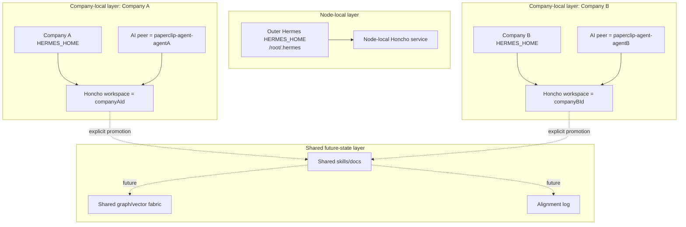

# Node Growth And Isolation

This document turns the active memory topology into practical node-growth
rules. It is for adding nodes and companies without accidental memory collision.

## Core Rules

- Outer Hermes is node-local.
- Paperclip company memory is company-scoped.
- Inner Hermes uses company-scoped `HERMES_HOME`.
- Honcho workspace key is the Paperclip `companyId`.
- Honcho AI peer is `paperclip-agent-<agent-id>`.
- No Paperclip company points at `/root/.hermes`.
- No company gets ambient access to another company's memory.
- Promotion into shared knowledge is explicit.
- Moving a company between nodes is a separate deliberate workflow.
- The current weak spot is manager/worker home sharing: manager and worker
  share company-scoped `HERMES_HOME`, not per-agent homes.

## Layer Diagram

Interpretation:

- Node-local operator state is separate from company execution state.
- Company A and Company B do not share Hermes homes or Honcho workspaces.
- Shared future-state layers only receive knowledge through explicit promotion.

## Node Addition Checklist

For a new outer-Hermes node:

- Install outer Hermes with its own node-local `HERMES_HOME`.
- If using Honcho, use node-specific outer workspace and peer names.
- Keep outer Hermes separate from Paperclip company homes.
- Do not reuse company IDs for outer Hermes scope.

For a new Paperclip execution node:

- Bootstrap the node to the reference-node shape.
- Start self-hosted Honcho on loopback.
- Bring up Paperclip with the direct `hermes_local` execution path.
- For each company, prepare a company-scoped `HERMES_HOME`.
- Render `honcho.json` with `workspace = companyId`.
- Render `aiPeer = paperclip-agent-<agent-id>` after agent creation.
- Validate with a bounded assigned issue that explicitly closes itself.

For a company move between nodes:

- Treat the move as a migration, not a new bootstrap.
- Preserve or migrate Paperclip company state.
- Preserve or migrate company `HERMES_HOME`.
- Preserve or migrate the company Honcho workspace.
- Confirm agent IDs still match expected Honcho peer names.
- Accept that recreating agents may fork or lose memory continuity.

## What Not To Do

- Do not point Paperclip `hermes_local` at `/root/.hermes`.
- Do not let two companies share one `HERMES_HOME`.
- Do not let two companies share one Honcho workspace.
- Do not assume Honcho replaces Hermes local memory.
- Do not treat a successful process exit as issue completion.
- Do not create a delegated child issue already assigned when the proven path
  requires create-then-activate sequencing.
- Do not describe the current manager/worker topology as per-agent local-memory
  isolation.
- Do not mount one node's Hermes home into another node as an implicit migration.

## Promotion Rule

Cross-company and cross-node learning happens through explicit promotion into:

- shared docs
- shared skills
- shared knowledge repos
- future shared graph/vector layers after they exist

It does not happen through shared runtime homes, shared company workspaces, or
ambient provider state.
