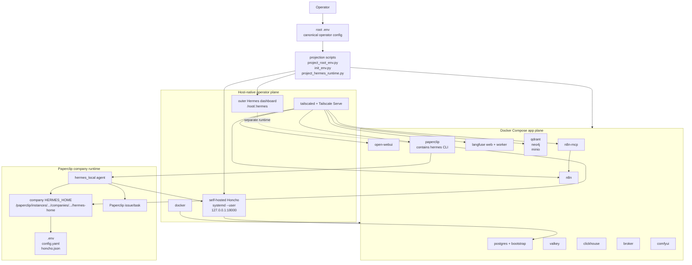
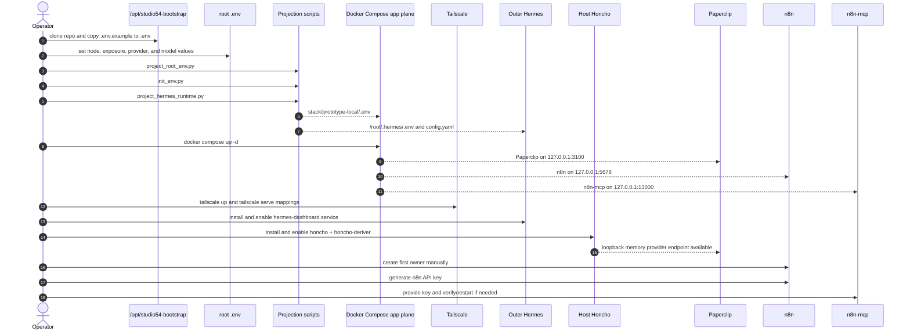
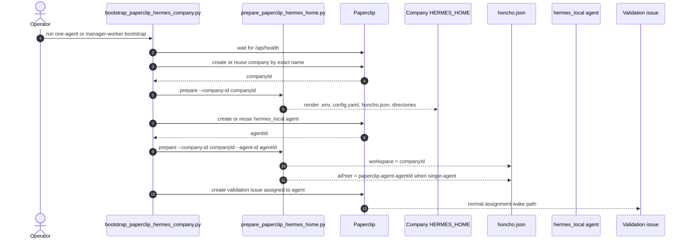
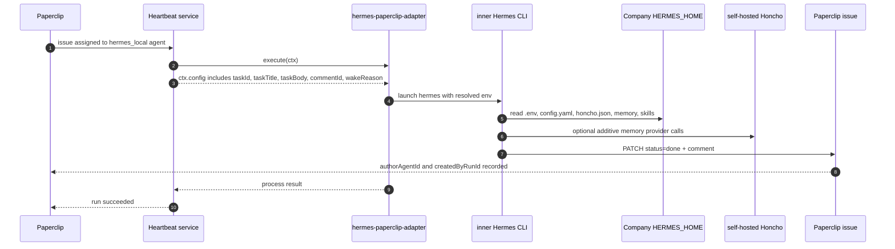
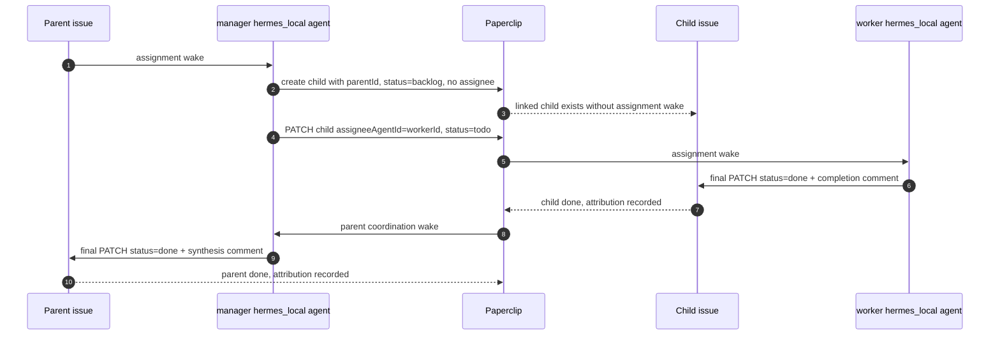

# VPS Launch And Company Operation

This is the canonical integration map for the current reference-node bring-up
and the active Paperclip company execution path.

It is intentionally narrower than the long-term north-star architecture. It
documents the path that has been proven or directly required by the fresh-node
work.

Detailed references:

- [Current contract](current-contract.md)
- [Bootstrap module](bootstrap-module.md)
- [Reference node target](../reference-node-target.md)
- [Operator install runbook](../../../deploy/vps/INSTALL.md)
- [Paperclip hermes_local contract](../paperclip-hermes-local-contract.md)
- [Company bootstrap](../company-bootstrap.md)
- [Operator initialization flow](../operator-init-flow.md)

## Current Scope

This document covers:

- fresh VPS bootstrap shape
- service ownership and exposure
- root `.env` projection into runtime files
- host-native outer Hermes
- host-native self-hosted Honcho
- Docker Compose app-plane services
- Paperclip direct `hermes_local` execution
- one-agent and manager/worker company bootstrap
- n8n and n8n-mcp initialization boundaries
- empirical contracts learned during proof work

This document does not make the gateway-first Paperclip path active. The
Paperclip -> Hermes gateway path remains optional/future-state for Paperclip
task execution.

## Active System Map



Interpretation:

- The root `.env` is the source of truth for node-level operator config.
- Projection scripts generate service/runtime files; generated files are not
  edited as canonical config.
- Containerized services run in the app plane.
- Outer Hermes is host-native and separate from Paperclip-internal Hermes.
- Paperclip is containerized, but its image is also the execution environment
  for direct `hermes_local` agents.
- Company runtime state is anchored by company-scoped `HERMES_HOME`.
- Honcho is self-hosted and additive to Hermes local state.

## Launch Sequence



Current launch caveat:

- `stack/prototype-local/scripts/launch.sh` delegates to `bin/1215 up`, whose
  comments and some historical docs still reflect the older Phase-H/gateway
  lifecycle.
- The active fresh-node runbook is [INSTALL.md](../../../deploy/vps/INSTALL.md)
  plus the direct `hermes_local` company bootstrap scripts.
- Treat `bin/1215` and `launch.sh` as tooling surfaces that need a dedicated
  verification/alignment slice before they become the only documented launch
  path for the current direct contract.

## Service Ownership

| Surface | Owner | Current role |
| --- | --- | --- |
| root `.env` | operator | canonical node config |
| projection scripts | repo | render runtime env/config files |
| Docker Compose | app plane | starts Paperclip, n8n, n8n-mcp, Langfuse, data services, Open WebUI, ComfyUI, broker |
| Tailscale Serve | operator ingress | private access to containerized operator services |
| outer Hermes | host-native | operator agent/dashboard under `/root/.hermes` |
| Honcho | host-native `systemd --user` | self-hosted long-horizon memory provider on loopback |
| Paperclip | containerized control plane | company, agent, issue, run, comment state |
| inner Hermes | Paperclip execution environment | direct `hermes_local` runtime for company agents |
| n8n | containerized operator service | workflow automation after first-owner setup |
| n8n-mcp | containerized operator service | structured access to n8n after real n8n API key exists |

## Company Bootstrap Sequence



Manager/worker caveat:

- manager and worker currently share one company-scoped `HERMES_HOME`
- the shared home has one home-local `honcho.json`
- the last agent-aware render can determine the active `aiPeer`
- this is not per-agent Hermes memory isolation
- per-agent Hermes homes remain future work

## One-Agent Issue Execution



The run is not complete merely because Hermes exits successfully. The issue is
complete when the agent sends one run-scoped PATCH containing both:

```json
{
  "status": "done",
  "comment": "DONE: <completion summary>"
}
```

Required request context:

- `Authorization: Bearer $PAPERCLIP_API_KEY`
- `X-Paperclip-Run-Id: $PAPERCLIP_RUN_ID`

## Manager/Worker Delegation



Delegation rules:

- create child issue linked first
- keep it unassigned and `backlog` at creation time
- activate with a PATCH setting `assigneeAgentId` and `status: "todo"`
- worker closes the child explicitly
- manager closes the parent only after required child work is done
- do not rely on issue text references when `parentId` is available

## n8n And n8n-mcp Boundary

n8n and n8n-mcp are part of the operator service set, but they are not the
active Paperclip company execution path.

Current rules:

- n8n is deployed by Compose.
- The first n8n owner/admin account is created manually by the operator.
- The n8n API key is generated from inside n8n after first-owner setup.
- n8n-mcp depends on that real n8n API key.
- Legacy helper scripts that seed n8n or Open WebUI owner state are not the
  default reference-node initialization path.

Operational implication:

- Do not present n8n-mcp as ready for authenticated n8n management until the
  operator has completed n8n first-owner setup and supplied the API key.

## Empirical Contracts Learned The Hard Way

These are not theoretical preferences. They were learned from failed or
partially successful proof runs.

### Runtime Placement

- Host-native outer Hermes does not make `hermes_local` work inside Paperclip.
- The Paperclip image must contain a working `hermes` CLI.
- The proven in-container launcher path is
  `/usr/local/bin/hermes -> /opt/hermes-agent/venv/bin/hermes`.
- The Hermes launcher and the Python interpreter used by the Hermes venv must
  be executable by the Paperclip runtime user.
- Installing the venv under a root-private path can fail even when `hermes` is
  on `PATH`.

### Filesystem Ownership

- Company `HERMES_HOME` preparation must chown the company tree to the
  Paperclip runtime UID/GID.
- Root-owned company directories can let the database row be created and then
  fail when Paperclip tries to materialize managed instructions.
- Ownership and permissions are part of runtime correctness.

### Adapter Config

- Paperclip persists adapter env values as binding objects.
- Local adapters must receive resolved values, not unresolved persisted binding
  objects.
- Passing unresolved objects produced invalid values such as `[object Object]`.
- `hermes-paperclip-adapter` builds its prompt from `ctx.config`.
- Assignment wakes must surface `taskId`, `taskTitle`, `taskBody`,
  `commentId`, and `wakeReason` into adapter config.
- If those fields are missing, an assignment wake can degrade into the adapter's
  no-task heartbeat branch.

### Comments, Runs, And Wakes

- Useful task output must become the issue comment, not runtime diagnostic
  noise.
- Runtime diagnostics should remain in logs, run artifacts, and traces.
- Completion comments need correct `authorAgentId`.
- Completion comments need correct `createdByRunId`.
- An agent's own completion comment must not wake the same agent again.
- Parent wakeups should happen for coordination-relevant child transitions such
  as `done` or `blocked`, not incidental runtime noise.

### Completion Semantics

- Paperclip does not infer issue completion from adapter/process success.
- Splitting completion into separate comment and status updates can leave the
  issue `in_progress`.
- The active completion contract is one final PATCH with both `status: "done"`
  and completion comment content.

### Manager/Worker Sequencing

- A worker issue created already assigned can wake too early.
- The observed fast failed worker run happened during Paperclip embedded
  Postgres `pg_trgm` setup before Hermes executed.
- The clean sequencing is create linked child first, unassigned and `backlog`,
  then activate by PATCH with worker assignee and `todo` status.

### Memory And Honcho

- Honcho is additive; it does not replace Hermes local memory.
- Company isolation starts with company-scoped `HERMES_HOME`.
- Honcho workspace maps to Paperclip `companyId`.
- One-agent bootstrap can render `aiPeer = paperclip-agent-<agent-id>`.
- Manager/worker currently shares one company home and one home-local
  `honcho.json`; that is not per-agent peer-file isolation.
- Honcho service environment precedence matters. A module-local developer
  `.env` can override the intended systemd environment unless disabled.
- Inner Hermes needs the Honcho provider dependency in the Paperclip execution
  image when Honcho memory is expected.

### Operator Initialization

- n8n first-owner setup is operator-owned, not silently seeded by default.
- n8n-mcp cannot be considered fully initialized until a real n8n API key
  exists.
- Open WebUI first-owner setup follows the same operator-owned principle.

## Current Gaps

These remain open and should not be implied as solved:

- one idempotent end-to-end fresh-node launcher for the current direct path
- verified `launch.sh` / `bin/1215` alignment with the direct `hermes_local`
  contract
- per-agent Hermes homes for manager/worker companies
- formal per-task Honcho session mapping
- automatic Tailscale auth-key provisioning
- n8n/n8n-mcp workflow integration into Paperclip company operations
- gateway-first Paperclip execution with first-class issue/comment/result
  semantics
