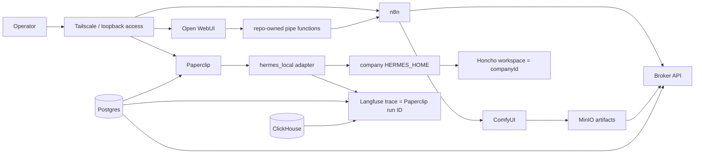

# 1215-VPS Current State

This is the repo-grounded snapshot for Studio54 as it exists now. It separates
the pieces that are runnable today from service scaffolding, operator runbooks,
and future-state architecture.

For the assembly map, see [deployable-unit.md](deployable-unit.md). For the
implementation path back to a single repeatable VPS unit, see
[reconstruction-plan.md](reconstruction-plan.md).

## Current Shape

The active execution path is direct Paperclip -> Hermes through per-company
`hermes_local`. The Paperclip -> Hermes gateway exists as repo-owned
scaffolding, but it is not the active Paperclip task execution path.

## Runnable App Plane

[stack/prototype-local/docker-compose.substrate.yml](../../stack/prototype-local/docker-compose.substrate.yml)
is the only runnable compose target. It binds compose-managed host ports to
`127.0.0.1` and includes:

| Area | Services |
| --- | --- |
| Continuity | `broker`, `postgres`, `broker-bootstrap`, `postgres-bootstrap` |
| Workflow/UI | `open-webui`, `n8n`, `n8n-mcp` |
| Company/task orchestration | `paperclip` |
| Observability | `langfuse-web`, `langfuse-worker`, `clickhouse` |
| Storage/memory substrates | `minio`, `minio-init`, `valkey`, `qdrant`, `neo4j` |
| Media | `comfyui`, `shared-data-init` |

Current operator entry points:

- `./bin/1215 up`
- `./bin/1215 status`
- `./bin/1215 smoke`
- `./bin/1215 logs <service>`
- `./bin/1215 down`

The workflow layer has repo-owned assets under:

- `stack/prototype-local/open-webui/functions/`
- `stack/prototype-local/n8n/`
- `stack/prototype-local/scripts/bootstrap_n8n.py`
- `stack/prototype-local/scripts/sync_openwebui_functions.py`
- `stack/prototype-local/scripts/test_openwebui_n8n_broker.py`
- `stack/prototype-local/scripts/test_n8n_mcp_functional.py`

The validated local workflow path is Open WebUI pipe -> n8n webhook -> broker
continuity records. The validated media path is n8n -> ComfyUI -> MinIO ->
broker artifact registration.

## Company And Memory Plane

The active company bootstrap implementation is:

- `./bin/1215 company bootstrap --template-file <template>`
- `stack/prototype-local/scripts/bootstrap_paperclip_hermes_company.py`
- `stack/prototype-local/scripts/prepare_paperclip_hermes_home.py`
- `stack/prototype-local/templates/paperclip-hermes-one-agent.json`
- `stack/prototype-local/templates/paperclip-hermes-manager-worker.json`

The bootstrap path creates or reuses a Paperclip company, prepares a
company-scoped Hermes home, creates `hermes_local` agents, rerenders
`honcho.json` after the final agent ID is known, and creates a validation
issue.

Active memory contract:

- Paperclip owns companies, agents, issues, comments, assignment, and run
  state.
- Hermes local state is isolated by company `HERMES_HOME`.
- Honcho is additive long-horizon memory, not a replacement for Hermes local
  state.
- Honcho `workspace` is the Paperclip `companyId`.
- Honcho `aiPeer` is `paperclip-agent-<agentId>` after the agent-aware render.
- The current manager/worker topology shares one company `HERMES_HOME`; it is
  not per-agent Hermes home isolation.

## Host-Native And Operator Plane

The repo contains host-native service scaffolding:

- `stack/services/honcho/install.sh`
- `stack/services/honcho/honcho.service.in`
- `stack/services/honcho/honcho-deriver.service.in`
- `stack/services/hermes-gateway/`
- `deploy/vps/systemd/hermes-dashboard.service`
- `deploy/vps/systemd/paperclip-bridge.service`
- `deploy/vps/ufw-rules.sh`

Honcho is intended to run host-native as `systemd --user` against the shared
substrate Postgres on `127.0.0.1:5433`. Outer/operator Hermes remains separate
from Paperclip-internal Hermes runs.

The VPS bring-up sequence is still a manual runbook in
[deploy/vps/INSTALL.md](../../deploy/vps/INSTALL.md). It covers Ubuntu
packages, root `.env`, runtime projection, compose up, Tailscale Serve,
outer Hermes, Honcho user units, Paperclip company bootstrap, and proofs. It is
not yet packaged as one idempotent installer.

## Topology And Node Declarations

[stack/topology/targets.json](../../stack/topology/targets.json) defines:

- `prototype-local`: runnable through the prototype compose file and includes
  Paperclip.
- `vps-hub`: declared as the intended hub shape, but `compose_files` is empty,
  so it is not runnable as a target yet.

[nodes/linux-prototype/](../../nodes/linux-prototype/) exists as the current
repo-owned node manifest area. Role overlays exist for media/tooling, while
`core` and `vps` are still role vocabulary without their own compose overlay
directories.

## Vendored Modules

`modules/` contains vendored snapshots, not active Git submodules. The old
`.gitmodules` metadata was removed because Git was tracking these directories as
ordinary source trees rather than submodule pointers.

Runtime-required today:

- `modules/paperclip`: Paperclip compose image build context
- `modules/honcho`: host-native Honcho install source
- `modules/hermes-agent`: Hermes runtime/probe source used by validation and
  host/runtime scripts

Reference or future-facing today:

- `modules/local-ai-packaged`
- `modules/hermes-paperclip-adapter`
- `modules/hermes-agent-self-evolution`
- `modules/autoreason`
- `modules/n8n-mcp`
- `modules/n8n-skills`

These snapshots do not update automatically. Updating them requires an
intentional vendor update or replacement with a pinned package/image.

## Proof And CI Plane

The verifier-first lane exists and currently proves repo health plus simulated
memory isolation:

- `scripts/simulate-vps-bootstrap.sh`
- `scripts/verify-simulated-vps-bootstrap.py`
- `scripts/proof/collect-node-proof.py`
- `scripts/proof/verify-node-proof.py`
- `scripts/proof/paperclip-coordination-proof.py`
- `schemas/proof/node-proof.schema.json`
- `docs/proofs/node-proof-contract.md`

CI lanes:

- `Studio54 validation` / job `validate`
- `VPS bootstrap simulation` / job `simulated-vps-bootstrap`

Current proof status:

- Simulation memory canaries cover separate company Hermes homes, host-vs-company
  Hermes home separation, Honcho workspace mapping, and Honcho AI peer mapping.
- `./bin/1215 proof node --json` collects and verifies the node proof contract.
- Live Paperclip coordination proof exists as a script, but it is not yet part
  of the default node proof.

## Current Gaps

- No single idempotent command installs host prerequisites, projects env,
  starts compose, installs host-native units, configures Tailscale Serve,
  bootstraps a company, and collects a live proof.
- `vps-hub` is declarative only.
- Tailscale Serve configuration is documented but not represented as a
  repo-owned reusable config asset.
- The Paperclip image contract depends on executable Hermes plus the Honcho
  provider dependency being available inside the Paperclip runtime.
- The manager/worker path does not yet provide per-agent Hermes homes or
  formal per-task Honcho sessions.
- Live/staging Paperclip coordination proof is available but not yet integrated
  into the node proof collector.
- Secrets and first-owner UI setup remain operator-controlled.
