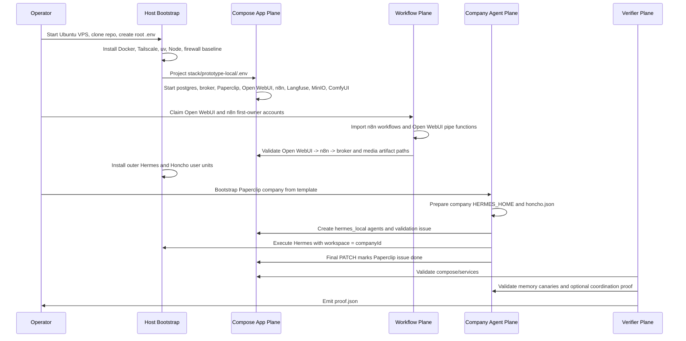
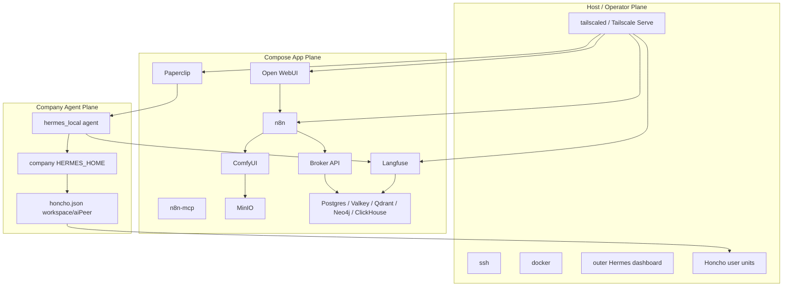
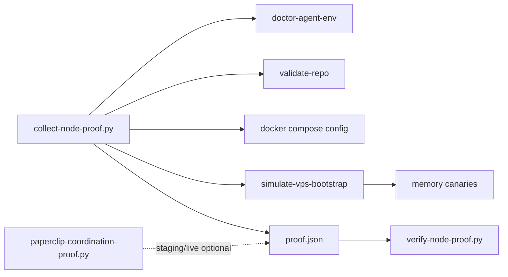

# Deployable Unit

This document maps the current fragmented pieces into the private-first
Studio54 deployable unit. It describes what the unit is meant to produce, where
each piece lives, and what is still manual.

## Unit Boundary

The deployable unit is a plain Ubuntu node that produces:

- a loopback-bound compose app plane
- host-native operator services
- private operator access over Tailscale
- repo-owned Open WebUI and n8n workflow wiring
- Paperclip companies with direct `hermes_local` agents
- company-scoped Hermes homes with Honcho memory mapping
- proof artifacts that show the node shape and memory boundaries

It is not yet one command. The current operator path is assembled from
`deploy/vps/INSTALL.md`, `./bin/1215`, projection scripts, compose, service
installers, company bootstrap templates, and proof scripts.

## Six-Lane Assembly

## Source Inputs And Generated State

Source-of-truth inputs:

- root `.env` and `.env.example`
- `stack/prototype-local/.env.example`
- `stack/prototype-local/docker-compose.substrate.yml`
- `stack/topology/targets.json`, `services.json`, and `roles.json`
- `nodes/linux-prototype/`
- company templates in `stack/prototype-local/templates/`
- vendored runtime sources in `modules/paperclip`, `modules/honcho`, and
  `modules/hermes-agent`

Projection scripts:

- `stack/prototype-local/scripts/project_root_env.py`
- `stack/prototype-local/scripts/init_env.py`
- `stack/prototype-local/scripts/project_hermes_runtime.py`

Generated runtime state:

- `stack/prototype-local/.env`
- `/root/.hermes/.env`
- `/root/.hermes/config.yaml`
- `/root/.config/1215-vps/honcho.env`
- per-company `.env`, `config.yaml`, `honcho.json`, skills, sessions, logs,
  memories, and state under the Paperclip company `HERMES_HOME`

Rule: edit source inputs, then regenerate runtime files. Generated runtime
state is not the contract.

## Vendored Runtime Inputs

The active deployable unit still depends on a few upstream source snapshots
under `modules/`. These are tracked as ordinary files in this repo; they are not
live Git submodules and do not update automatically.

- `modules/paperclip` builds the Paperclip compose image.
- `modules/honcho` is the host-native Honcho install source.
- `modules/hermes-agent` provides Hermes runtime/probe code used by validation
  and host/runtime scripts.

Reference-only modules can be removed later, but runtime-required modules should
stay until replaced by pinned release artifacts, Docker images, packages, or an
explicit vendor-update workflow.

## Runtime Layers

## Current Proof Contract

The default proof flow is simulation-first. It does not mutate the live VPS and
does not yet prove a full live Paperclip manager/worker flow unless the
coordination proof is run separately with staging/live Paperclip inputs.

## What A Fresh Node Produces Today

Using the current runbook and scripts, a prepared Ubuntu node can produce:

- localhost-bound Paperclip, Open WebUI, n8n, n8n-mcp, Langfuse, MinIO,
  ComfyUI, broker, and supporting data stores
- private Tailscale Serve URLs for the operator-facing services
- host-native outer Hermes and Honcho when installed through the runbook
- imported n8n workflows and Open WebUI pipe functions after first-owner UI
  setup and API-key placement
- Paperclip companies with direct Hermes agents and company-scoped
  `HERMES_HOME`
- Honcho config mapping company ID to workspace and Paperclip agent ID to AI
  peer
- node proof artifacts under `.artifacts/node-proof/`

The remaining gap is packaging these steps into a single idempotent installer
with preflight, rerun behavior, and a live proof gate.
