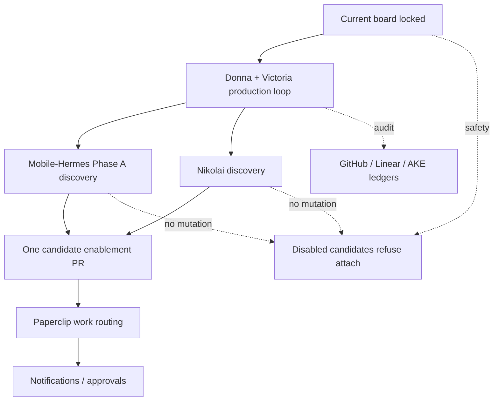

# Full Operation Roadmap

> **For Hermes:** Use subagent-driven-development skill to implement this plan task-by-task when execution begins.

**Goal:** Move the available Donna / Victoria / Mobile-Hermes / Studio54 agent stack from validated infrastructure into a practical operating system that can do real work safely.

**Architecture:** Studio54 remains the control-plane and reusable grid pattern. Donna is the hub/queen-bee operator. Victoria is the first enabled remote cloud worker. Nikolai is the first enabled WSL workstation persona for explicit operator live attach only. Android/Termux stay visible but disabled until their own readiness contracts pass. GitHub, Linear, AKE, and Paperclip provide durable work state and audit trails.

**Tech Stack:** Hermes Agent, Studio54 `hermes-grid`, SSH, tmux, Tailscale, Moshi iPad app as operator terminal, GitHub PRs/issues, Linear, Agent Knowledge Exchange, Mobile-Hermes, Paperclip, Honcho.

---

## Current Operating Board

| Agent / Surface | Current state | Operational use today | Blocker before wider use |
|---|---|---|---|
| Donna / Studio54 | Hub ready | Architecture, planning, PRs, ledgers, grid checks, dispatch decisions | Needs packaged operating cadence and runbook |
| Victoria | Enabled, validated remote SSH/tmux tab | Remote operations liaison, communications drafts, research, documentation, bounded tasks | Needs work-intake/sound-off routine before heavy production work |
| Android / Termux | Visible, disabled `pending-mobile-edge` | Evidence source and future mobile edge | Mobile-Hermes PR #2 review/merge, then non-mutating discovery |
| Nikolai | Enabled for explicit WSL workstation live attach | Workstation/GPU-capable engineering persona, bounded local engineering prep | Needs division/lab charter before Paperclip autonomy or GPU work |
| Paperclip | Company/task surface | Durable issue/work assignment backbone | Needs clear handoff between Donna grid and Paperclip issues |
| GitHub / Linear / AKE | Active ledger surfaces | Audit trail, plans, PR state, cross-agent evidence | Needs one canonical status rhythm |

## Definition of “Full Operation”

Full operation does **not** mean every candidate tab is live. It means the agents we already have can accept work, execute bounded pieces, report status, and preserve evidence without improvising.

Minimum full-operation baseline:

1. **Donna can see the board.** `hermes-grid roster` and `status` show who exists and who is allowed to run.
2. **Donna can assign work.** Work is represented in GitHub/Linear/Paperclip with an owner, scope, safety line, and expected sound-off.
3. **Victoria can execute bounded remote tasks.** She receives single-line envelopes, performs scoped work, and reports using the shared sound-off schema.
4. **Results land durably.** Docs, PRs, issues, and Linear comments capture outcomes without raw runtime dumps or secrets.
5. **Disabled nodes stay disabled.** Android/Termux and other candidates do not
   become live just because they are visible; Nikolai's live attach remains
   explicit-operator-only and does not grant Paperclip autonomy or GPU scope.
6. **Real work can start now.** Use Donna + Victoria for planning, communications, business operations, research, documentation, and lightweight repo work while mobile readiness and Nikoli's lab/Paperclip charter mature.

## Operating Rhythm

### Daily / Session Start

Run from Studio54:

```bash
./bin/hermes-grid roster
./bin/hermes-grid status
./bin/hermes-grid --check
```

If Victoria work is expected:

```bash
./bin/hermes-grid --check --probe-remote
./bin/hermes-grid attach Victoria --dry-run
```

Do **not** attach to disabled candidates.

### Work Intake

Every real task should have:

```text
owner: Donna | Victoria | Paperclip agent | Miguel
surface: GitHub issue | Linear issue | Paperclip issue | chat
scope: one paragraph
allowed_changes: explicit list
forbidden_changes: explicit safety line
validation: exact checks expected
sound_off_due: when/how to report
ledger_targets: where the summary must land
```

### Sound-Off Schema

All agent reports should use:

```text
outcome:
confirmed:
changed:
validation:
safety:
next_action:
```

## Phase 0 — Lock the Current Board

**Objective:** Make the current working set boring, visible, and repeatable.

**Files / surfaces:**
- `docs/architecture/full-operation-roadmap.md`
- `docs/architecture/remote-persona-grid.md`
- `stack/topology/hermes-grid.json`
- Studio54 issue #8
- Linear `121-33`

**Tasks:**

1. Add this roadmap to Studio54.
2. Link it from `README.md` near Remote Persona Grid.
3. Run docs safety scan for Tailnet IPs, key paths, token assignments, and raw runtime dumps.
4. Post the roadmap to Studio54 issue #8 and Linear `121-33`.
5. Keep Mobile-Hermes PR #2 open until reviewed; do not merge it automatically unless Miguel authorizes.

**Acceptance criteria:**

- Roadmap exists on a branch/PR.
- No runtime state changes.
- No secrets, raw panes, host inventory, session DBs, memory stores, or credentials are included.

## Phase 1 — Donna + Victoria Production Loop

**Objective:** Start doing real work with the two agents that are ready: Donna as hub, Victoria as remote operator.

**Why first:** This gives immediate operational value without waiting for phone/Nikolai enablement.

**Victoria work classes allowed now:**

- Communications planning and drafting.
- Mexico/Tijuana/business setup research.
- Documentation updates.
- Repo triage and PR review notes.
- Vendor/partner research summaries.
- Structured checklists and operating procedures.

**Victoria work classes not yet allowed without explicit approval:**

- Secrets handling.
- Infrastructure mutation.
- Service restarts.
- Firewall changes.
- Credential setup.
- Unbounded autonomous loops.
- Raw runtime log publication.

**Implementation tasks:**

1. Create a `docs/operations/victoria-work-intake.md` runbook.
2. Define Donna-to-Victoria prompt envelope examples as single-line prompts.
3. Add a `Victoria sound-off` template using the shared schema.
4. Add a first real work ticket in Linear or GitHub for Victoria, preferably communications-plan work.
5. Run one bounded Victoria task and record only the sanitized sound-off.

**Acceptance criteria:**

- Victoria completes one useful bounded work item.
- The result is captured in a PR, issue comment, or AKE note.
- Donna can summarize the work without relying on raw tmux logs.

## Phase 2 — Mobile-Hermes Phase A Discovery

**Objective:** Prepare Android/Termux for future operation without enabling it.

**Dependency:** Mobile-Hermes PR #2 should be reviewed and merged first.

**Tasks:**

1. Merge Mobile-Hermes PR #2 after review/authorization.
2. Run `verify-grid-readiness.sh --dry-run` from `main`.
3. Decide whether the final grid tab should be `Android`, `Termux`, or both.
4. Confirm the intended transport contract without printing hostnames/IPs/key paths:
   - Tailscale SSH?
   - Termux SSH?
   - USB/ADB?
   - Moshi as human terminal only?
5. Confirm whether the phone has a stable tmux/session wrapper policy.
6. Document battery/Tailscale/Termux:Boot requirements.
7. Keep Studio54 topology disabled.

**Acceptance criteria:**

- Redacted readiness report exists.
- No phone mutation occurred.
- Studio54 still refuses Android/Termux attach.
- Next action is clear: phone-side validation, wrapper install, or transport setup.

## Phase 3 — Nikolai Discovery

**Objective:** Bring the workstation/GPU/build node to the same readiness level as Android/Termux candidates.

**Tasks:**

1. Confirm intended SSH alias/transport without exposing host details.
2. Confirm OS, GPU/build role, and allowed workload classes.
3. Confirm Hermes presence or installation plan.
4. Confirm tmux session/window naming convention.
5. Define attach wrapper contract.
6. Add a disabled topology note or readiness doc update if missing.

**Acceptance criteria:**

- Nikolai has a redacted readiness contract.
- No builds, GPU jobs, installs, or services run during discovery.
- Studio54 still refuses attach until explicit enablement.

## Phase 4 — Paperclip Work Routing

**Objective:** Turn the grid into real productive flow, not just remote terminal management.

**Operating rule:** GitHub/Linear/Paperclip own work state; tmux/SSH only provide runtime access.

**Tasks:**

1. Define which work goes to Paperclip issues vs GitHub issues vs Linear.
2. Add a `docs/operations/work-routing.md` runbook.
3. Define when Donna delegates to Victoria vs Paperclip local agents.
4. Define status sync cadence:
   - Donna summary to Miguel.
   - Victoria sound-off to ledger.
   - Paperclip issue status update.
5. Run one real work item through the chosen path.

**Acceptance criteria:**

- One task is assigned, executed, validated, and closed through the durable surface.
- Donna can reconstruct what happened without reading raw runtime logs.

## Phase 5 — Enable Candidates One at a Time

**Objective:** Graduate nodes from visible candidates to operational agents safely.

**Enablement gate per candidate:**

```text
1. readiness contract documented
2. disabled topology entry exists
3. non-mutating probe passes
4. dry-run attach passes
5. explicit Miguel approval
6. bounded live attach passes
7. PR merges enablement
8. ledger updated
```

Recommended order:

1. Android/Termux, because mobile operator access matters to Miguel.
2. Nikolai, because workstation/GPU/build work unlocks heavier execution.
3. WSL or other bridge nodes only after the first two are boring.

## Phase 6 — Notifications and Approvals

**Objective:** Add comfort and mobility without changing the runtime trust boundary.

Potential surfaces:

- Telegram: human-facing approvals, summaries, alerts.
- Moshi iPad app: operator terminal surface.
- Mosh protocol: optional resilience upgrade, only with firewall/UDP approval.
- `moshi-hook`: optional future notification/push surface, only after explicit pairing approval.

**Rule:** Notification surfaces do not become the source of truth. Studio54/GitHub/Linear/Paperclip remain canonical.

## First Real Work Recommendation

Start with **Victoria communications operations**, because she is already validated and the user is actively working on the communications plan.

Suggested first ticket:

```text
Title: Draft Victoria communications operating plan v0
Owner: Victoria
Hub: Donna
Scope: Produce a concise outbound/inbound communications plan for Miguel's current ventures, including channels, approval rules, cadence, templates, and safety boundaries.
Allowed changes: docs/operations/victoria-communications-plan.md or issue comment only.
Forbidden changes: no secrets, no account setup, no sending external messages, no service/runtime changes.
Validation: Donna reviews for completeness, safety, and next-action clarity.
Sound-off: outcome, confirmed, changed, validation, safety, next_action.
```

## Mermaid Phase Ladder



## Safety Boundaries

Do not include or publish:

- `.env` content.
- API keys, tokens, passwords, auth exports.
- SSH private keys or private key paths.
- raw hostnames/IPs/Tailnet IPs unless explicitly required and approved.
- raw tmux panes, runtime logs, Hermes session DBs, memory stores.
- credential material or pairing secrets.

Do not perform without explicit approval:

- phone SSH/ADB live probes beyond documented non-mutating scope.
- installing packages on phone/Nikolai/Victoria.
- enabling Android/Termux/Nikolai topology tabs.
- service starts/restarts.
- firewall changes.
- Mosh protocol setup.
- `moshi-hook` pairing.

## Immediate Next Actions

1. Open this roadmap as a Studio54 docs PR.
2. Review and merge Mobile-Hermes PR #2 when Miguel approves.
3. Create the Victoria communications-plan work item.
4. Execute one bounded Victoria task and record the sound-off.
5. Decide Android/Termux transport contract from evidence, not assumption.
