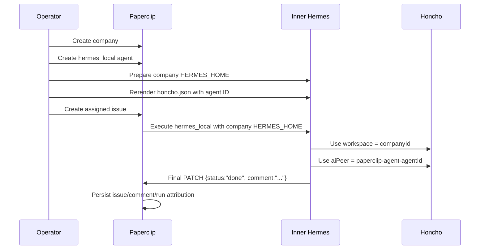
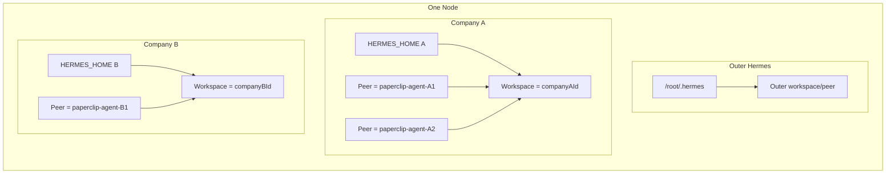

# Honcho Memory Topology

Canonical set entrypoint:
[canonical/README.md](canonical/README.md)


This document is the concrete operator spec for memory topology on the active
direct `hermes_local` architecture.

It answers four questions:

1. What memory/state layers exist.
2. Which boundaries are active today.
3. What is shared versus isolated.
4. How to add nodes over time without causing memory collision or accidental
   cross-company bleed.

Primary related docs:

- [memory-model.md](memory-model.md)
- [hermes-runtime.md](hermes-runtime.md)
- [paperclip-hermes-local-contract.md](paperclip-hermes-local-contract.md)
- [reference-node-target.md](reference-node-target.md)
- [company-bootstrap.md](company-bootstrap.md)

## Status

This document describes the active direct-path contract plus the current
deferred items.

Active today:

- direct per-company `hermes_local`
- company-scoped `HERMES_HOME`
- self-hosted Honcho on loopback
- Paperclip company ID used as Honcho workspace for inner Hermes runs
- `paperclip-agent-<agent-id>` used as the inner Hermes Honcho AI peer when the
  bootstrap/prep step has the agent ID

Deferred today:

- per-agent Hermes home isolation inside one company
- per-task Honcho session mapping as a formalized contract
- gateway-first memory topology as an active Paperclip execution path

## Core Rule

Memory is not one thing.

The runtime has three distinct layers:

1. Paperclip control-plane state
2. Hermes local/runtime memory
3. Honcho reasoned long-horizon memory

Those layers must not be conflated.

## Layer Model

### 1. Paperclip

Paperclip owns:

- companies
- agents
- issues/tasks
- assignments
- parent/child task linkage
- comments/results
- run records
- approvals/budgets when used

Paperclip does **not** own the agent's long-term cognitive memory.

### 2. Hermes Local State

Hermes local state lives under `HERMES_HOME`.

That includes:

- `.env`
- `config.yaml`
- `SOUL.md`
- `skills/`
- `sessions/`
- `logs/`
- `memories/`
- `state.db`
- `honcho.json` when Honcho is enabled

Hermes local state is where:

- built-in persistent memory lives
- session history lives
- skills/procedural memory lives
- agent-local identity and prompt-shaping context live

### 3. Honcho

Honcho is additive.

Honcho provides:

- workspace isolation
- peer identity
- session/message reasoning structure
- cross-session memory consolidation
- long-horizon retrieval/reasoning context

Honcho does **not** replace Hermes local state.

## Active Isolation Boundaries

### Outer Hermes

Outer Hermes is operator-level and must remain separate from company execution.

Current boundary:

- runtime home: `/root/.hermes`
- not part of any Paperclip company by default

Rule:

- do not point Paperclip `hermes_local` at `/root/.hermes`

### Inner Hermes

Inner Hermes means Hermes launched by Paperclip through direct
`hermes_local`.

Current boundary:

- one `HERMES_HOME` per company
- path:
  `/paperclip/instances/<instance-id>/companies/<company-id>/hermes-home`

Rule:

- one company must not inherit another company's Hermes home
- one company must not silently share another company's Honcho workspace

### Current Manager/Worker Caveat

For the currently proven manager/worker bootstrap path:

- manager and worker share the same company-scoped `HERMES_HOME`

This is acceptable as the current practical contract because the active
boundary is company-scoped, not per-agent-home-scoped.

It is **not** per-agent Hermes memory isolation.

Per-agent Hermes homes remain future work.

## Current Proven Mapping

### Inner Company Runs

For active direct-path company work:

- Paperclip company ID -> Honcho workspace
- Paperclip agent ID -> Honcho AI peer
- company `HERMES_HOME` -> local Hermes state boundary

Current generated `honcho.json` shape:

```json
{
  "baseUrl": "http://127.0.0.1:18000",
  "workspace": "<paperclip-company-id>",
  "peerName": "operator-root",
  "aiPeer": "paperclip-agent-<agent-id>",
  "enabled": true
}
```

Fallback behavior when `agent-id` is not known yet:

- use company-scoped fallback AI peer first
- rerender with `--agent-id` after agent creation

### Outer Hermes

Outer Hermes should have its own distinct Hermes state and, if Honcho is used,
its own distinct Honcho scope.

Recommended current operator rule:

- outer Hermes workspace/peer naming must be node-specific and operator-specific
- do not reuse company workspaces for outer Hermes ambient operator memory

## Isolation Table

| Layer | Isolation key | Active today | Notes |
| --- | --- | --- | --- |
| Paperclip company state | `companyId` | Yes | Control-plane tenant boundary |
| Inner Hermes local state | company `HERMES_HOME` | Yes | Current proven runtime boundary |
| Inner Honcho workspace | `companyId` | Yes | Current proven workspace mapping |
| Inner Honcho AI peer | `paperclip-agent-<agent-id>` | Yes | Proven when rerendered with `--agent-id` |
| Per-agent Hermes home | agent-specific `HERMES_HOME` | No | Deferred |
| Per-task Honcho session | issue/task ID | Not formalized | Deferred contract |
| Outer Hermes local state | `/root/.hermes` | Yes | Separate from Paperclip company runs |

## Sequence Diagram



## Swimlane: Shared vs Isolated



Interpretation:

- Company A and Company B do not share Hermes homes.
- Company A and Company B do not share Honcho workspaces.
- Agents inside Company A currently may share the same company Hermes home, but
  they still have distinct Honcho AI peers when configured correctly.
- Outer Hermes is separate from both companies.

## Node Addition Rules

This is the part that matters when adding more nodes.

### Rule 1: Treat Node-Local Runtime State As Node-Local

Each node gets its own:

- outer Hermes home
- Honcho process
- Paperclip runtime data tree when that node hosts Paperclip

Do not mount one node's Hermes home into another node's runtime path.

### Rule 2: Use Stable Tenant Keys

For company work:

- use the Paperclip `companyId` as the Honcho workspace key
- use the Paperclip `agentId` as the Honcho AI peer suffix

This avoids inventing a second identity registry.

### Rule 3: Never Share Company Memory Ambiently

If a new node joins the estate:

- it does **not** get access to another company's memory by default
- it only gets access if you deliberately move or recreate:
  - the company Hermes home
  - the company Honcho workspace
  - the company Paperclip state

### Rule 4: Outer Hermes Must Be Namespaced Per Node

Recommended naming for outer Hermes Honcho scope:

- workspace: `node-<node-slug>-outer`
- AI peer: `outer-hermes-<node-slug>`
- operator peer: `operator-root` or a deliberate operator identity

Do not reuse:

- company IDs
- generic `hermes`
- generic `user`

across many nodes without namespacing.

### Rule 5: Company Workspaces Must Be Company-Owned, Not Node-Owned

For inner Hermes:

- workspace belongs to the company identity, not the machine hostname

This matters if you ever move a company from one node to another.

The company can move nodes.
Its identity should not change.

### Rule 6: Promotion Is Explicit

Cross-company or cross-node learning should happen by explicit promotion into:

- shared skills
- shared docs
- shared knowledge repo

Not by silent shared runtime homes.

## Adding A New Node

Use this procedure.

### Case A: Adding A New Operator/Outer-Hermes Node

1. Install outer Hermes on the node.
2. Give it its own `HERMES_HOME`.
3. If using Honcho, point it at the node's self-hosted Honcho service.
4. Create node-specific outer workspace/peer naming.
5. Do **not** point it at existing company `HERMES_HOME` trees.

Result:

- new node has independent operator memory
- no company collision

### Case B: Adding A New Paperclip Execution Node

1. Bootstrap the node as a reference node.
2. Install/start self-hosted Honcho on loopback.
3. Bring up Paperclip and the direct `hermes_local` execution path.
4. For each company on that node:
   - create/prepare company `HERMES_HOME`
   - render `honcho.json` with `workspace = companyId`
   - render `aiPeer = paperclip-agent-<agent-id>`
5. Validate bounded task execution.

Result:

- each node can host companies safely
- each company remains isolated by company ID and company home

### Case C: Moving A Company To Another Node

This is the dangerous one.

Minimum requirements:

1. preserve or migrate Paperclip company state
2. preserve or migrate company `HERMES_HOME`
3. preserve or migrate company Honcho workspace data
4. verify agent IDs still match the expected Honcho peer names

Do not treat a move as ?just recreate the agent? unless you are willing to lose
or fork memory continuity.

## Recommended Naming

### Workspaces

- company runtime:
  - `<paperclip-company-id>`
- outer Hermes:
  - `node-<node-slug>-outer`

### Peers

- operator peer:
  - `operator-root` or explicit operator handle
- company AI peer:
  - `paperclip-agent-<agent-id>`
- outer Hermes AI peer:
  - `outer-hermes-<node-slug>`

### Sessions

Current state:

- per-task Honcho session mapping is deferred

Recommended future rule:

- use the Paperclip issue/task ID as the Honcho session identifier

## Current Weak Spots

These are known and should not be hidden.

1. Manager/worker topology currently shares one company Hermes home.
2. Per-task Honcho session mapping is not the formal active contract yet.
3. Outer Hermes naming/promotion policy should stay explicit and node-scoped.
4. Moving companies across nodes is not yet a productized workflow.

## Lessons Learned And Gotchas

These are not theoretical. They came out of the proof and hardening work.

### 1. `HERMES_HOME` Is The Real Local Memory Boundary

This is the most important operational gotcha.

If `HERMES_HOME` is wrong, memory isolation is wrong.

Consequences:

- a company can accidentally read/write the wrong local memory
- an inner Hermes run can silently fall back to ambient `/root/.hermes`
- debugging becomes misleading because the process still "works"

Operator rule:

- always confirm the exact active `HERMES_HOME`
- never assume the current shell or container default is correct

### 2. Honcho Is Additive, Not The Whole Memory Story

If Honcho is wired correctly but `HERMES_HOME` is wrong, you still have a bad
memory topology.

Honcho does not erase:

- local `MEMORY.md`
- local `USER.md`
- local skills
- local sessions
- local `state.db`

Operator rule:

- verify both the Honcho mapping and the Hermes home mapping

### 3. Agent-Aware `honcho.json` Must Be Rerendered After Agent Creation

At first prep time, you may only know the company ID.

That means:

- workspace can be correct immediately
- AI peer may still be a fallback

Operator rule:

- rerun prep with `--agent-id` after creating the agent
- otherwise the company can be correct while the AI peer is still generic

### 4. Shared Company Home Means "Last Render Wins" For Some Home-Local Files

This matters in the current manager/worker topology.

Because manager and worker share one company-scoped `HERMES_HOME`:

- the local `honcho.json` is one file
- rerendering for the worker means the file reflects the worker's AI peer last

This is acceptable for the current practical contract, but it is a real caveat.

Operator rule:

- do not describe the current manager/worker shape as per-agent local-memory
  isolation
- if you need separate home-local state per agent, that is future work

### 5. Create-Time Assignment Can Trigger Bad Races

This was observed in manager/worker bootstrap.

Creating a delegated child already assigned can trigger an immediate assignment
wake at the wrong moment.

Observed failure:

- Paperclip setup failed before Hermes even ran
- embedded Postgres `pg_trgm` loading surfaced during the create-time wake path

Working rule:

- create the linked child first
- leave it unassigned / `backlog`
- then activate it with one PATCH that sets:
  - `assigneeAgentId`
  - `status: "todo"`

### 6. Ownership Is Part Of Memory Topology

If the company tree is owned by the wrong UID/GID, memory files may exist but
not actually be writable by the Paperclip runtime user.

Symptoms can look like:

- partial bootstraps
- agent creation failures
- missing local writes
- misleading runtime behavior

Operator rule:

- treat directory ownership as part of the memory contract
- not as a separate filesystem detail

### 7. Service Env Precedence Can Silently Break Honcho

Honcho service startup can look healthy at first glance while using the wrong
database/provider settings if module-local `.env` files override the intended
systemd environment.

Working rule:

- generated service env must stay authoritative
- keep `PYTHON_DOTENV_DISABLED=1` where that is the active service contract

### 8. The Runtime Must Actually Contain The Honcho Dependency

A correct `honcho.json` is not enough.

If the Hermes runtime inside the Paperclip execution environment does not
include the Honcho provider dependency:

- Honcho memory will not actually work for inner Hermes

Working rule:

- validate the runtime dependency, not just the config file

### 9. Observability And Memory Are Different Layers

Langfuse helps you observe runs.
It does not define memory boundaries.

Similarly:

- broker events help correlate runs
- Paperclip run IDs help trace workflows
- none of that replaces checking `HERMES_HOME`, workspace, and peer identity

Operator rule:

- use observability to debug the memory contract
- do not mistake observability for the memory contract itself

### 10. Promotion Must Be Intentional

When a company learns something useful, there are two very different outcomes:

1. leave it in company-local Hermes memory/skills
2. promote it into shared skills/docs/knowledge

Confusing these creates accidental bleed between local adaptation and shared
operating doctrine.

Operator rule:

- company-local mutation is allowed
- cross-company reuse is explicit

## What Not To Do

Do not do these:

- point many companies at `/root/.hermes`
- let two companies share one Honcho workspace
- let node hostname become the company identity
- assume Honcho replaces Hermes local memory
- assume manager/worker already has per-agent Hermes-home isolation
- silently share runtime homes across nodes

## Recommended Next Future Slices

In order:

1. formalize per-task Honcho session mapping
2. decide whether manager/worker needs per-agent Hermes homes
3. define migration/export rules for moving a company between nodes
4. define outer-Hermes node-template naming and bootstrap defaults

## Operator Checklist

When wiring memory on a new node, confirm:

- Honcho is self-hosted and local to the node
- outer Hermes has its own `HERMES_HOME`
- each company has its own `HERMES_HOME`
- company `honcho.json` uses:
  - `workspace = companyId`
  - `aiPeer = paperclip-agent-<agent-id>`
- no company points at `/root/.hermes`
- cross-company knowledge transfer is explicit, not ambient

