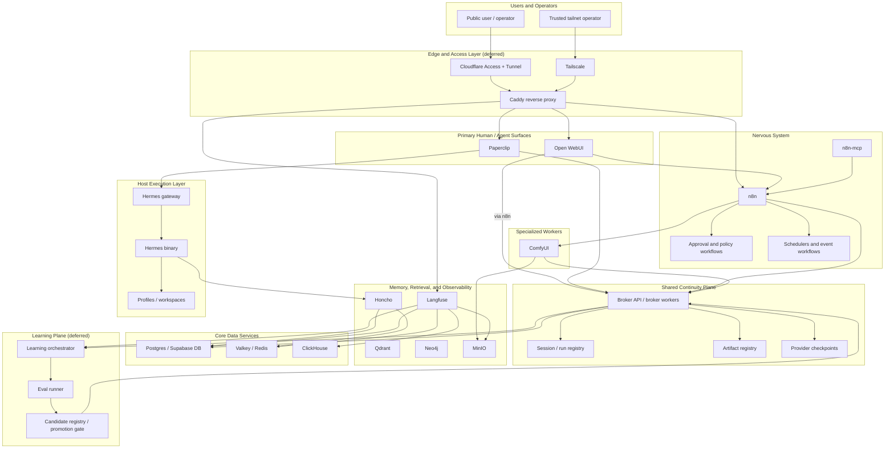

# 1215-VPS North Star

Authoritative target for this repository. Describes what the prototype becomes
when complete. This is the canonical reference for architectural decisions;
other documents in `docs/architecture/` describe the current state, the path to
get here, or the historical framing.

The original `overview.md` is retained as a legacy reference. This document
supersedes it.

## Executive Summary

`1215-vps` is a self-hosted orchestration stack for a Hermes-backed autonomous
business system. This node (the Linux prototype) is built to resemble the
eventual VPS node: a rich, opinionated core that keeps a broad service set but
reorganizes it around explicit first-party architectural roles instead of
inheriting the shape of upstream projects.

The system has three architectural centers and one deliberate adjacent layer:

1. The **shared continuity plane** is the system of record.
2. The **nervous system** automates, routes, approves, and coordinates work.
3. The **human and agent surfaces** provide interaction, orchestration, and
   execution.
4. The **learning plane** (adjacent) observes runtime behavior, evaluates
   improvement candidates offline, and promotes approved changes back into the
   system.

Properties that make this more than "copy and stack":

- the continuity model lives outside any one UI or provider
- automation is centralized in `n8n`, not spread across ad hoc webhooks
- memory providers and orchestration tools are pluggable edges, not the root
- Hermes is host-native, sandboxed by an explicit container-to-host boundary
- infrastructure services are kept only when they serve a defined role

## Layered Architecture

## Architectural Centers

### 1. Shared Continuity Plane

The canonical system spine. It owns:

- append-only broker events
- session and run registration
- artifact manifests and lineage
- provider sync checkpoints
- trace correlation identifiers

Everything important publishes into this plane or consumes from it. No single
UI, workflow engine, or memory provider becomes the system of record.

### 2. Nervous System

`n8n` is a first-class control layer. It owns:

- approved workflow automation
- event routing
- long-running jobs
- scheduling
- human approval gates
- cross-service coordination
- reactions to health and policy events
- dispatch of specialized workers (see below)

This makes automation explicit and auditable instead of embedding logic in
scattered service-specific glue.

### 3. Human and Agent Surfaces

Two interaction surfaces:

- **Open WebUI** — primary human-facing shell for chat, retrieval, tool use,
  and safe actions. It does not write to the continuity plane directly; it
  reaches the broker through `n8n`.
- **Paperclip** — specialist orchestration workbench and multi-agent runtime.
  Runs as a container. It is the only container that crosses the
  container-to-host boundary to invoke Hermes.

Hermes itself is host-native. It is exposed into containers only through a
repo-owned gateway and shim (see Host Execution Layer, below).

### 4. Learning Plane

Self-improvement belongs here:

- evaluation dataset generation
- candidate skill / prompt / tool evolution
- benchmark replay and comparison
- candidate storage and lineage
- promotion and rollback policy

The reference modules `autoreason` and `hermes-agent-self-evolution` belong
here. They are not first-line runtime services. For this prototype the
learning plane is deferred — see Out of Scope.

## Orchestrator-CEO Company

The flagship Paperclip company on this node is `orchestrator-ceo`. It pairs:

- a Paperclip company definition (UI, project state, task graph)
- a host-native Hermes **profile** named `orchestrator-ceo`
- a dedicated workspace directory the Hermes subprocess operates in

Target layout:

- `HERMES_HOME=/var/lib/hermes/orchestrator-ceo` — profile home (SQLite-backed
  session state, skills, config; host-only, not container-mounted)
- `/var/lib/paperclip/workspaces/orchestrator-ceo/` — working directory
  Hermes runs in (`cwd`), where workspace files live
- `.env` resolved at execution time from a host secret file; never stored
  raw in Hermes profile state, never bind-mounted into containers

Paperclip invokes the CEO by issuing a `StartRun` to the Hermes gateway over
the UDS. The gateway spawns `hermes chat --profile orchestrator-ceo
--resume <session> --yolo` as a host subprocess with the correct `cwd` and
environment. Output streams back through the gateway; run lifecycle events
(`run.created`, `run.started`, `run.completed`, `run.failed`) are published
to the broker so the continuity plane owns the session history.

This is the pattern for any future Paperclip company: company-in-container,
profile-on-host, boundary through the gateway.

## Specialized Workers

Specialized workers are containerized services that produce artifacts on
demand. They are invoked by `n8n`, write their outputs to MinIO, and publish
`artifact.created` lineage events to the broker. They do not talk to the
continuity plane except via those artifact events; they are stateless with
respect to session state and memory.

The first specialized worker on this node is **ComfyUI**, covering image and
video generation. The intended call path is:

1. User prompt enters through Open WebUI (or directly through Paperclip)
2. `n8n` receives the request, applies policy gates, and dispatches to ComfyUI
3. ComfyUI produces the media and writes the file to MinIO
4. ComfyUI (or the `n8n` step wrapping it) publishes an `artifact.created`
   event to the broker with the MinIO object reference
5. Downstream consumers (Paperclip, Open WebUI, other companies) see the new
   artifact via the broker event stream

Future specialized workers of the same shape (transcription, batch inference,
data synthesis) plug in the same way. They do not get their own memory
providers and do not write to Honcho / Qdrant / Neo4j directly.

## Host Execution Layer

Hermes is never containerized on this node. The host execution layer is the
smallest possible trusted boundary between the container mesh and host-native
agent runtime.

- **Hermes binary** runs as a host-native subprocess spawned on demand, with
  `HERMES_HOME` per-profile, `cwd` per-company-workspace, and env resolved at
  spawn time.
- **Hermes gateway** is a long-running host daemon (systemd `--user` unit)
  exposing a Unix domain socket in a restricted directory. It accepts
  `StartRun` / `AttachRun` / `CancelRun` requests from Paperclip, enforces a
  profile allowlist, runs as a non-root user with restricted `PATH`, and
  publishes run lifecycle events to the broker. It is the *only* surface
  through which containers can touch the host agent runtime.
- **Profiles and workspaces** live on the host filesystem only. They are
  never bind-mounted into containers. Honcho (also host-native) is the
  memory service Hermes reaches over `http://127.0.0.1:<honcho-port>` without
  crossing the container boundary.

## Service Roles

| Service | Runtime mode | Role |
|---|---|---|
| Open WebUI | Container | Primary human-facing shell for chat, retrieval, tool use, and safe actions |
| Paperclip | Container | Specialist orchestration dashboard and multi-agent runtime; only container that reaches the Hermes gateway |
| n8n | Container | Trusted workflow and policy engine |
| n8n-mcp | Container | Structured programmatic access to `n8n` capabilities |
| ComfyUI | Container | Specialized media-generation worker; writes artifacts to MinIO, publishes lineage to broker |
| Broker API / workers | Container | Canonical continuity and event plane |
| Postgres / Supabase DB | Container | Durable relational store and broker schema host |
| Valkey / Redis | Container | Cache and queue support for selected services |
| MinIO | Container | Canonical artifact and object store |
| Qdrant | Container | Semantic retrieval plane |
| Neo4j | Container | Fact and relationship graph |
| ClickHouse | Container | Analytics store (Langfuse backend) |
| Langfuse | Container | First-class tracing and lineage surface |
| Honcho | Host-native (systemd --user) | Shared-memory provider for host-native Hermes; reuses shared Postgres via dedicated DB + pgvector |
| Hermes gateway | Host-native (systemd --user) | Narrow container-to-host execution boundary; UDS, profile allowlist, run lifecycle publisher |
| Hermes | Host-native (subprocess) | Actual agent execution runtime; spawned per-run by the gateway |
| Learning orchestrator / eval runner | Deferred | Offline improvement loop for skills, prompts, tools, and later selected code |

## Exposure Invariants

The prototype holds to four exposure classes, enforced by compose binds,
filesystem permissions, and (eventually) the edge layer:

- **Host-only.** Never leaves the machine under any condition. Hermes gateway
  UDS (`/run/hermes-gateway/gateway.sock`, mode `0660`, gateway group),
  `HERMES_HOME=/var/lib/hermes/<profile>/`, Paperclip workspace directories,
  host secret files. Not bind-mounted into any container except the gateway
  UDS into Paperclip's container.
- **Localhost-only.** Bound to `127.0.0.1` only. Every container in
  `docker-compose.substrate.yml` — Postgres, Valkey, MinIO, Qdrant, Neo4j,
  ClickHouse, Langfuse, Open WebUI, n8n, n8n-mcp, broker, ComfyUI. No
  `0.0.0.0` binds anywhere.
- **Tailnet-private** (future). Reached only from a trusted tailnet via
  Tailscale, fronted by Caddy. Engineering / research nodes, operator access.
- **Public** (future). Reached from the open internet via Cloudflare Access
  and Tunnel, fronted by Caddy. Narrow allowlist only.

The last two classes are not active on the prototype — see Out of Scope.

## Not In Scope for This Prototype

Named explicitly so this document stands alone:

- **Edge layer** (Cloudflare Access + Tunnel, Tailscale, Caddy). The prototype
  runs with localhost-only binds. Edge work is a separate later phase.
- **Learning plane runtime.** The reference modules (`autoreason`,
  `hermes-agent-self-evolution`) stay in the repo as submodules / references
  only. No `learning-orchestrator`, `eval-runner`, or `candidate-registry`
  runtime services.
- **Engineering and Research node integration.** This prototype resembles the
  future VPS node only. Cross-host publish / consume flows are deferred.
- **Remote provider sync beyond explicit adapter contracts.** Honcho adapter,
  Langfuse adapter, broker adapter: in scope. Anything else: out.

## v1 Scope Boundary

The first complete version of this node is **prototype-complete**, not
cross-host-complete.

Included in v1:

- substrate services (Postgres, Valkey, MinIO, Qdrant, Neo4j, ClickHouse,
  Langfuse)
- continuity plane (broker API + workers + schema)
- human surface (Open WebUI)
- nervous system (n8n, n8n-mcp)
- specialist surface (Paperclip container)
- host execution layer (Hermes + Hermes gateway + Honcho)
- specialized workers (ComfyUI)
- orchestrator-ceo company and profile
- `broadcast_*` and `artifact_*` Hermes skills wrapping the broker
- Langfuse trace correlation across broker + Hermes

Deferred beyond v1: see Not In Scope.

For node-specific responsibilities and promotion policy across VPS, prototype,
engineering, and research nodes, see [node-roles.md](node-roles.md).
