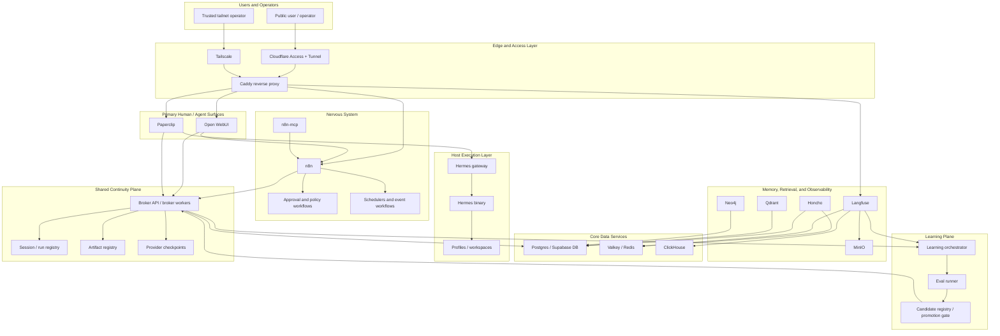

# 1215-VPS Architecture Overview

> **Legacy document.** The authoritative architectural target for this
> prototype is now [north-star.md](north-star.md). This document is retained
> for historical reference; its framing and diagram have been superseded
> (in particular: the service roles table there includes a Runtime mode
> column, the Mermaid diagram has corrected edges, and ComfyUI is named as
> a specialized worker). For the current repo state, see
> [current-state.md](current-state.md); for the plan to reach the target,
> see [roadmap.md](roadmap.md).

## Executive Summary
`1215-vps` is a rich, self-hosted orchestration stack for a Hermes-backed autonomous business system. It is intentionally not a bare-bones deployment. The design keeps a broad service set, but reorganizes it around explicit first-party architectural roles instead of inheriting the shape of upstream projects.

The system has three architectural centers:

1. The **shared continuity plane** is the system of record.
2. The **nervous system** automates, routes, approves, and coordinates work.
3. The **human and agent surfaces** provide interaction, orchestration, and execution.

The system also has one deliberate adjacent layer:

4. The **learning plane** observes runtime behavior, evaluates improvement
   candidates offline, and promotes approved changes back into the system.

This is what makes the stack more elegant than "copy and stack":

- the continuity model lives outside any one UI or provider
- automation is centralized in `n8n`, not spread across ad hoc webhooks
- memory providers and orchestration tools are pluggable edges, not the root design
- infrastructure services are retained only when they serve a defined role

For how those roles are split across the VPS and future local nodes, see
[Node Roles](node-roles.md). (The earlier `deployment-model.md` has been
superseded by `north-star.md` and was removed in the Phase 0 trim.)

## Layered Architecture

## Architectural Centers

### 1. Shared Continuity Plane
This is the canonical system spine. It owns:

- append-only broker events
- session and run registration
- artifact manifests and lineage
- provider sync checkpoints
- trace correlation identifiers

Everything important publishes into this plane or consumes from it. No single UI, workflow engine, or memory provider becomes the system of record.

### 2. Nervous System
`n8n` is promoted to a first-class control layer. It owns:

- approved workflow automation
- event routing
- long-running jobs
- scheduling
- human approval gates
- cross-service coordination
- reactions to health and policy events

This makes automation explicit and auditable instead of embedding logic in scattered service-specific glue.

### 3. Human and Agent Surfaces
The system has two interaction surfaces:

- **Open WebUI** is the primary human-facing shell
- **Paperclip** is the specialist orchestration workbench

Hermes remains host-native. It is exposed into containers only through a repo-owned gateway and shim.

### 4. Learning Plane
The learning plane is where self-improvement belongs:

- evaluation dataset generation
- candidate skill/prompt/tool evolution
- benchmark replay and comparison
- candidate storage and lineage
- promotion and rollback policy

The reference modules `autoreason` and `hermes-agent-self-evolution` belong
here. They are not first-line runtime services.

## Service Roles

| Service | Role |
|---|---|
| `Open WebUI` | Primary human-facing shell for chat, retrieval, tool use, and safe actions |
| `Paperclip` | Specialist orchestration dashboard and multi-agent runtime |
| `n8n` | Trusted workflow and policy engine |
| `n8n-mcp` | Structured programmatic access to `n8n` capabilities |
| `Broker API / workers` | Canonical continuity and event plane |
| `Postgres / Supabase DB` | Durable relational store and broker schema host |
| `Valkey / Redis` | Cache and queue support for selected services |
| `MinIO` | Canonical artifact and object store |
| `Qdrant` | Semantic retrieval plane |
| `Neo4j` | Fact and relationship graph |
| `Honcho` | Shared-memory provider behind adapter boundary |
| `Langfuse` | First-class tracing and lineage surface |
| `Hermes gateway` | Narrow container-to-host execution boundary |
| `Hermes` | Actual agent execution runtime |
| `Learning orchestrator / eval runner` | Offline improvement loop for skills, prompts, tools, and later selected code |

## Why This Is Not Just a Stacked Bundle
Upstream projects remain useful, but they do not define the architecture:

- `local-ai-packaged` provides substrate services, not the deployment model
- `Paperclip` provides orchestration tooling, not the continuity plane
- `Honcho` provides memory behavior, not the root contracts
- `Open WebUI` provides the shell, not the automation brain

The repo should therefore own:

- the continuity contract
- the workflow and approval model
- the exposure policy
- the Hermes boundary
- the learning and promotion policy
- the system health and audit rules
- the inter-node publish and replay model

## v1 Scope Boundary
The first complete version is **VPS-complete**, not cross-host-complete.

Included in v1:

- edge and routing
- substrate services
- continuity plane
- Open WebUI
- n8n
- Paperclip
- Hermes gateway
- Honcho adapter
- Qdrant, Neo4j, MinIO, Langfuse integrations

Deferred beyond v1:

- live Engineering-host and Research-host integrations
- remote provider sync beyond explicit adapter contracts

For node-specific responsibilities and promotion policy across VPS, prototype,
engineering, and research nodes, see
[node-roles.md](node-roles.md).
