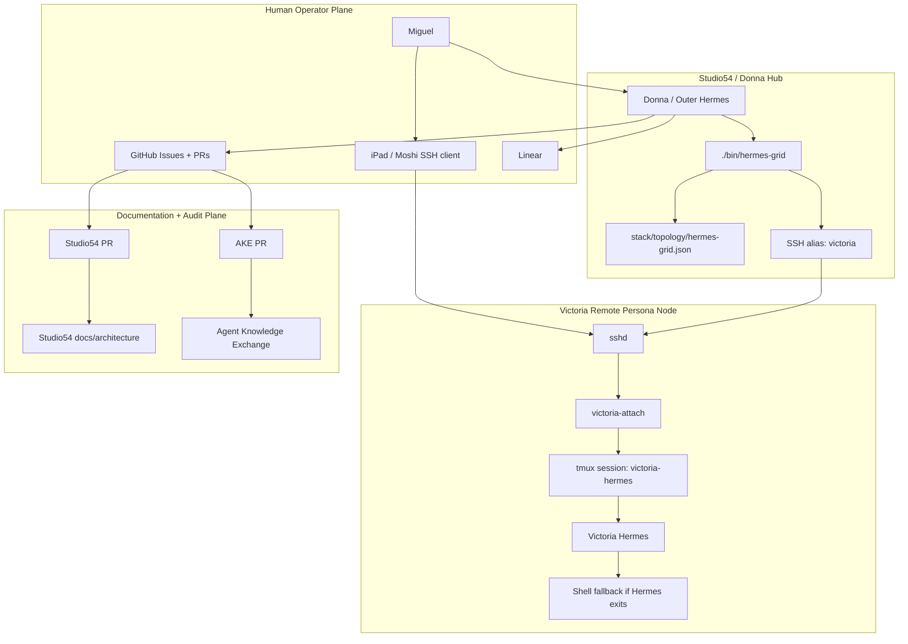
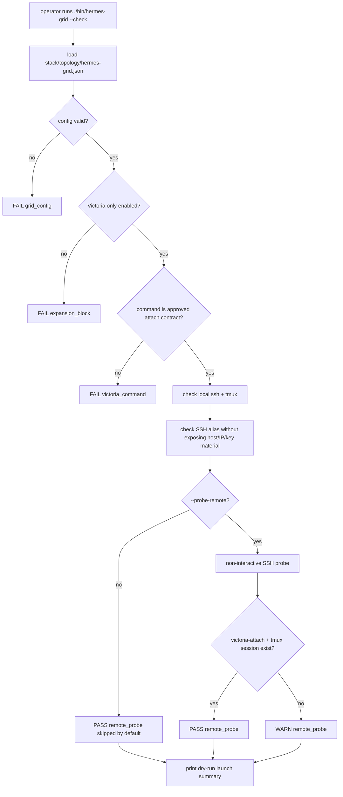
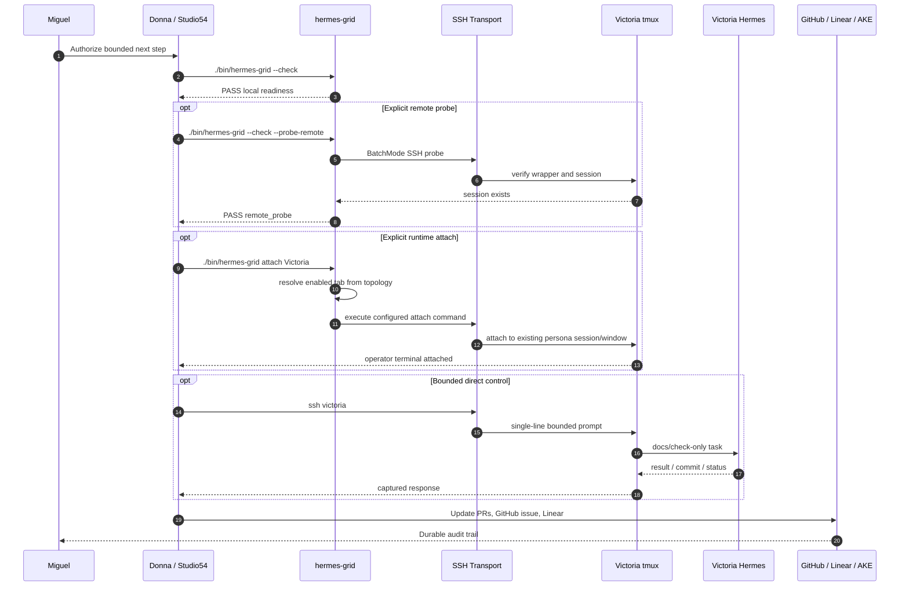
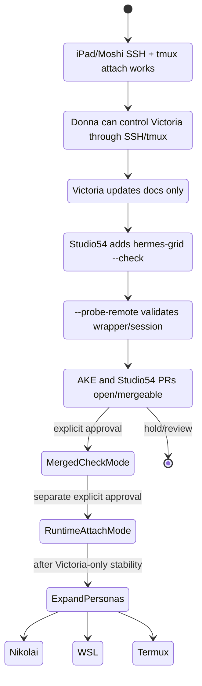

# Remote Persona Grid

This document defines the Studio54 operator grid for controlling remote Hermes
personas through safe, auditable SSH/tmux contracts.

It captures the architecture proven by the Victoria Phase 1 / Phase 1.5 work:
Miguel can reach Victoria from iPad/Moshi over SSH/Tailscale, Donna can operate
Victoria through bounded SSH/tmux control, and Studio54 now owns a read-only
`hermes-grid --check` readiness command before any runtime grid launch is added.

## Current Status

- `Victoria` is the first validated remote persona tab.
- `./bin/hermes-grid --check` exists as a read-only readiness mode.
- `./bin/hermes-grid --check --probe-remote` exists as an explicit, bounded
  remote probe.
- `./bin/hermes-grid attach <tab>` exists as explicit operator runtime attach mode.
- `./bin/hermes-grid attach Victoria --dry-run` prints the runtime attach plan
  without executing it.
- `Nikolai`, `WSL`, and `Termux` remain disabled/pending until the
  Victoria-only runtime attach path is proven boring and repeatable.

## Architectural Position

The remote-persona grid belongs to the **outer/operator Hermes control plane**.
It is not the same thing as Paperclip's inner `hermes_local` execution path.

The grid is:

- a Studio54 operator surface;
- a persona-to-transport topology contract;
- a readiness and future launch mechanism for remote Hermes personas;
- an auditable way for Donna to coordinate remote agents without copying
  runtime state.

The grid is not:

- a replacement for Paperclip issue or company state;
- a memory federation layer;
- a peer-to-peer autonomous mesh;
- a Moshi/Mosh requirement;
- a reason to copy `.env`, sessions, memory stores, or credentials between
  hosts.

## Source Artifacts

| Artifact | Purpose |
|---|---|
| `docs/architecture/remote-persona-grid.md` | Canonical architecture and rollout contract. |
| `stack/topology/hermes-grid.json` | Executable persona/tab topology manifest. |
| `./bin/hermes-grid` | Repo-root CLI shim for grid readiness checks and explicit operator attach. |
| `stack/control/control1215/hermes_grid.py` | Check, probe, and generic topology-driven attach implementation. |
| Agent Knowledge Exchange Victoria doc | Victoria-specific validation evidence and handoff history. |
| Linear / GitHub issues and PRs | Durable audit trail for rollout decisions. |

Studio54 owns the canonical architecture. Agent Knowledge Exchange preserves
reusable cross-agent evidence and lessons. Paperclip remains the system of
record when company issues, assignments, or approvals are involved.

## Control Planes

### Human Plane

Miguel operates through desktop, iPad/Moshi, Telegram, GitHub, Linear, and direct
chat with Donna.

### Operator Control Plane

Donna, running as outer/operator Hermes, makes architectural decisions, prepares
bounded work, runs Studio54 checks, and records outcomes.

### Transport Plane

Tailscale, SSH, and tmux carry the actual terminal/session connection. They are
transport details, not persona identity.

### Remote Runtime Plane

A remote persona such as Victoria runs in a host-local tmux session with a
persona-labeled window and a shell fallback if Hermes exits.

### Audit / Ledger Plane

GitHub PRs, GitHub issues, Agent Knowledge Exchange, and Linear record durable
state. Every substantive promotion should leave a sanitized trail there.

### Future Notification Plane

Telegram approvals, Mosh protocol, and `moshi-hook` are deferred. They require
explicit approval because they may introduce cloud state, host secrets, firewall
changes, or new approval surfaces.

## Architecture Diagram



## Control Plane Map

```mermaid
flowchart LR
    subgraph HumanPlane["Human Plane"]
        H1["Miguel"]
        H2["iPad / Moshi"]
        H3["Telegram future"]
    end

    subgraph OperatorPlane["Operator Control Plane"]
        O1["Donna / Outer Hermes"]
        O2["Studio54 CLI"]
        O3["hermes-grid"]
    end

    subgraph TransportPlane["Transport Plane"]
        T1["Tailscale"]
        T2["SSH"]
        T3["tmux"]
    end

    subgraph RuntimePlane["Remote Runtime Plane"]
        R1["Victoria Hermes"]
        R2["Shell fallback"]
        R3["Remote host tools"]
    end

    subgraph AuditPlane["Audit / Ledger Plane"]
        A1["Studio54 PRs"]
        A2["AKE PRs"]
        A3["GitHub Issues"]
        A4["Linear"]
    end

    subgraph FuturePlane["Deferred / Future Plane"]
        F1["Mosh protocol"]
        F2["moshi-hook"]
        F3["Telegram approvals"]
        F4["Nikolai / WSL / Termux"]
    end

    HumanPlane --> OperatorPlane
    HumanPlane --> TransportPlane
    OperatorPlane --> TransportPlane
    TransportPlane --> RuntimePlane
    OperatorPlane --> AuditPlane
    RuntimePlane --> AuditPlane
    FuturePlane -. explicit approval only .-> OperatorPlane
```



Important distinctions:

- The transport plane is not the control plane.
- Moshi is not the architecture; it is one human terminal client.
- Tailscale is not the persona identity; it is a private transport route.
- tmux is not the system of record; it is the remote session substrate.
- GitHub, Linear, and AKE are the durable audit trail for this rollout.

## Current Topology

The current topology is declared in `stack/topology/hermes-grid.json`.

Victoria is the only enabled remote tab:

```json
{
  "name": "Victoria",
  "enabled": true,
  "kind": "remote-ssh-tmux",
  "command": "ssh victoria -t victoria-attach",
  "ssh_alias": "victoria",
  "tmux_session": "victoria-hermes",
  "tmux_window": "Victoria"
}
```

Other planned tabs remain disabled/pending:

- `Nikolai`
- `WSL`
- `Termux`

## Terminology

### Persona

Human-facing agent identity, such as `Donna`, `Victoria`, or `Nikolai`.

### Transport Detail

The host, SSH alias, tailnet route, tmux session, tmux window, or wrapper command
that makes a persona reachable.

### Remote Tab

A Studio54 grid entry mapping persona identity to a transport contract.

### Check Mode

Read-only readiness validation:

```bash
./bin/hermes-grid --check
```

### Probe Mode

Explicit, bounded remote verification:

```bash
./bin/hermes-grid --check --probe-remote
```

### Runtime Attach Mode

Explicit operator attach to an enabled tab:

```bash
./bin/hermes-grid attach Victoria
```

Dry-run form:

```bash
./bin/hermes-grid attach Victoria --dry-run
```

Runtime attach is generic: the CLI resolves the requested tab from
`stack/topology/hermes-grid.json` and executes that tab's configured command. The
code should not hardcode Victoria-specific host details beyond the first enabled
topology entry used to prove the pattern.

Current guardrails:

- attach requires an explicit tab name;
- disabled tabs are refused without running a command;
- unsupported tab kinds are refused;
- dry-run prints the plan without executing it;
- attach does not send prompts, create sessions, install packages, modify
  firewall rules, or copy runtime state;
- output uses stable tab/command labels and continues to avoid resolved
  hostnames, IPs, private key paths, tokens, and raw pane captures.

## Readiness Contract

The default check must be safe to run repeatedly and must not attach to live
remote panes.

Expected PASS categories:

```text
PASS grid_config
PASS victoria_tab
PASS expansion_block
PASS victoria_command
PASS ssh_binary
PASS tmux_binary
PASS ssh_alias
PASS remote_probe
```

The default check should:

1. parse the topology manifest;
2. verify `Victoria` is the only enabled remote tab;
3. verify Nikolai/WSL/Termux remain disabled or pending;
4. verify Victoria's command is the approved attach contract;
5. verify local SSH and tmux are available;
6. verify the SSH alias is configured without printing host/IP/key material;
7. skip remote probing unless explicitly requested;
8. print a dry-run launch summary instead of opening sessions.

The optional remote probe may verify that the wrapper and tmux session exist, but
it must still avoid runtime attach or prompt injection.

## Readiness Flow



## Safe Operation Sequence



## Phase Ladder



## Direct-Control Prompt Rule

Interactive Hermes sessions use prompt-toolkit and do not always handle raw
multi-line tmux paste cleanly. Direct Donna-to-persona tasks should therefore
use single-line bounded envelopes, for example:

```text
Victoria docs-only task: update the Phase 1.5 grid plan; scope: documentation/check-mode only; no installs, no secrets, no service/firewall changes, no runtime promotion; report commit/PR state when done.
```

If a longer instruction is required, use a carefully verified wrapper/file
method rather than raw multi-line paste into a live Hermes prompt.

## Sound-Off Protocol

Remote personas should report substantive work in a consistent format:

```text
Outcome
Confirmed
Changed
Validation
Safety
Next Action
```

This format keeps multi-agent coordination readable and makes it easier for
Donna to summarize, compare, and promote work across personas.

## Safety Boundaries

Do not copy, commit, paste, or preserve any of the following in this doc, the
knowledge repo, PR bodies, issue comments, or Linear comments:

- `.env` files or values;
- API keys, provider tokens, OAuth exports, or pairing tokens;
- SSH private keys or private key paths;
- raw hostnames, public IPs, or Tailnet IPs unless explicitly required for a
  troubleshooting artifact;
- Hermes session databases;
- memory stores;
- raw tmux captures;
- raw Hermes transcripts;
- runtime cache/log dumps;
- Moshi share links, pairing tokens, or cloud-host registration secrets.

Use stable aliases and abstract readiness facts instead:

```text
SSH alias: victoria
hostname=<configured>
user=root
port=22
```

## Expansion Policy

Expansion remains Victoria-first.

Before enabling another persona tab, the following must be true:

1. the Victoria-only check-mode PR is merged;
2. default `./bin/hermes-grid --check` passes;
3. optional Victoria `--probe-remote` passes from the hub;
4. the canonical remote-persona grid doc is present;
5. Miguel explicitly approves the next expansion;
6. the new persona has its own documented transport contract, wrapper, tmux
   session/window, and safety boundaries.

Nikolai, WSL, and Termux should be added one at a time, each with check-mode
coverage before runtime attach behavior.

## Relationship To Paperclip

Paperclip remains the system of record for company work:

- companies;
- agents;
- issues;
- assignments;
- comments;
- approvals;
- budgets;
- routines.

The remote-persona grid is an outer/operator control surface. If a remote
persona performs Paperclip company work, that work must still be reflected back
through Paperclip's issue and approval model.

## Relationship To Agent Knowledge Exchange

Agent Knowledge Exchange stores reusable operational evidence and lessons. For
Victoria, it contains the Phase 1 handoff, validation caveats, communications
protocol, and setup notes.

Studio54 should link to AKE for Victoria-specific proof, but Studio54 owns the
canonical architecture and CLI/topology contracts.

## Deferred Work

Deferred until explicit approval:

- runtime launch/attach mode for `hermes-grid`;
- Nikolai tab enablement;
- WSL tab enablement;
- Termux tab enablement;
- Mosh protocol setup;
- `moshi-hook` installation/pairing;
- Telegram approval loops;
- automatic sound-off aggregation;
- broker-backed cross-node event publishing.

## Acceptance Criteria

This architecture is ready to use when:

- `docs/architecture/remote-persona-grid.md` is committed and linked from the
  Studio54 README;
- `stack/topology/hermes-grid.json` declares Victoria as the only enabled tab;
- `./bin/hermes-grid --check` passes locally;
- `./bin/hermes-grid --check --probe-remote` passes when explicitly requested;
- checks do not print host/IP/key material;
- AKE and Studio54 PRs link to each other and to the Linear issue;
- no runtime attach mode is implied before explicit approval.
